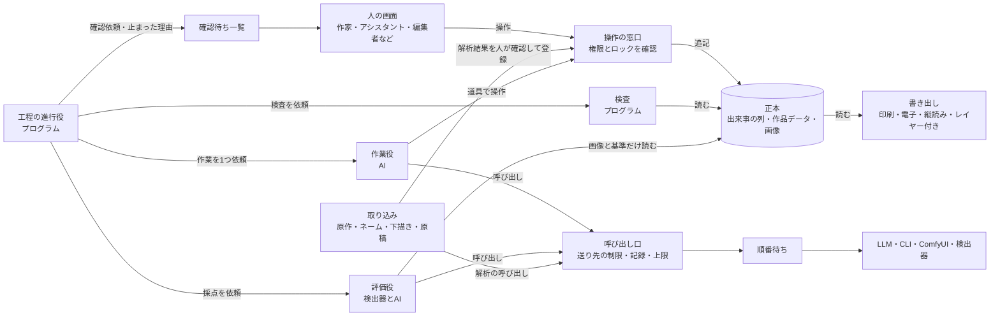

# V3ハーネス設計

作成 2026-09-27。V3（サーバーで動く漫画作成用のAIハーネス）の設計案。

## この文書の位置づけ
- **設計案であって、決定ではない。** 17章は私が理由を付けて決めたもの（2026-09-29）。理由が崩れたら変わり得る。
- 根拠は `llm_doc/V3ハーネスの方針と課題.md` の番号で示す。「方針n」は会話で決めたもの、「候補n」は調査で報告がある手、「課題n」は解決の必要がある項目。
- 「案」と書いた仕組みは私が考えたもので、根拠となる実測はない。**漫画で効くかは、方針・候補も含めてすべて未検証。**
- 既存のjs・llm_doc・PoC・検証記録は使っていない（フルスクラッチ）。これはハーネスの話で、画面には既存のjs（素材・文言・計算の部品）を使ってよい（2026-09-28）。

## 決まったこと（2026-09-27の会話）

| 決まったこと | この設計への反映 |
|---|---|
| プロ向け。あらゆる使用シーンを考える | 2章の使用シーンをすべて受ける。複数人での作業、紙と縦読み、白黒とカラーを最初から前提にする |
| 規制の閾値は後で決める | 年齢区分・表現の規制・実写の児童ポルノの判定は、記録する場所と止める仕組みだけを作る。閾値と判定の手段は後で決める（12章） |
| コマ割りなどの閾値は作りながら検証する | 閾値は、値・出典・検証の状態を持つデータにする。段2で検証する（7章） |
| 自前の実装はなるべく避ける | 部品ごとに既製のライブラリ・製品の候補を挙げ、自前で書くのは漫画に固有の部分だけにする（3.1）。候補はどれも未検証 |
| 画面の描画はFabric.jsにする（2026-09-28） | 選択・変形・画面上での文字編集（IMEも使える）を持つのはFabric.jsだった。Konvaには文字編集が無い。縦書き・網点はどちらにも無く自前。今の画面の流用はせず、新しく作る（3.1） |
| 既存のjsを使わないのはハーネスの話（2026-09-28） | 画面には、今の画面の素材（吹き出しの形・文字装飾の値）、文言（8言語の翻訳）、計算の部品（ナイフでのコマ分割・吹き出しの中の文字枠）を持ってきてよい |
| 読む向きは表示位置だけを切り替える。絵は反転しない（2026-09-29） | 作品ごとに右から・左からを持つ。`llm_doc/V3細部の決めごと.md` 1章 |
| 文字の向き（縦書き・横書き）は読む向きと別に持つ（2026-09-29） | 海外版は「右から読む・横書き」になる。`llm_doc/V3細部の決めごと.md` 2章 |
| 生成サービスごとに「1件ずつ」「同時にN件まで」を切り替える（2026-09-29） | 待ち行列をサービスごとに持つ。`llm_doc/V3細部の決めごと.md` 4.2 |
| 作る順番は段に分けず、全部を同時に作る。不可能なもの以外はすべて作る（2026-09-29） | 16章。媒体・言語・描き文字の方式は、どれかを選ばず全部を持つ |
| 安いサービスで作り、上位のモデルで直す・作り直す（2026-09-29） | 11章のモデルの使い分けを、工程ごと・1回ごとに画面で選べる形にする。`llm_doc/V3細部の決めごと.md` 4.3 |

---

## 1. 設計の芯

| # | 芯 | 根拠 |
|---|---|---|
| 1 | 正本は1つ。人もAIも「操作」でしか変えず、操作はすべて出来事の列に追記する | 方針2・15、候補9 |
| 2 | 答えが決まるものはプログラムで行い、判断が要るものだけAIに任せる | 候補3・4・33 |
| 3 | 作業は小さく区切る（1工程・1見開き・1コマ）。区切るたびに検査して記録する | 候補5 |
| 4 | 作る役と見る役を分ける。見る役には、画像と基準だけを見せる | 方針11、候補29・30 |
| 5 | 分からないものは「分からない」と出す。黙って差し替えたり、推測で埋めたりしない | 方針7、候補31 |
| 6 | 高い工程の前で直す。企画・構成・ネームの段で人と検査を厚くし、作画はネームを固めてから行う | 方針14 |
| 7 | 部品ごとに「どのモデルの弱点を補っているか」を書き、外せるようにする | 候補91・92 |
| 8 | どの工程からでも始められる。どの工程でも、人が作った物や取り込んだ物を受け取れる。AIにどこまで任せるかは、作業ごとに人が選ぶ | 2章の使用シーン（案） |
| 9 | 閾値・規格・規制はコードに書かず、作品ごとのデータとして持つ | 決まったこと、プロジェクトの決まり（フォールバック目的の決め打ちを置かない） |

---

## 2. 使用シーン

### 2.1 作り方

| # | シーン | 持ち込む物 | AIの役 | 要るもの |
|---|---|---|---|---|
| 1 | 一から作る | 依頼の一言、または企画 | 企画から仕上げまで | 全工程、人の確認 |
| 2 | 原作付き・コミカライズ | 脚本、小説、プロット | 構成・ネーム以降 | 原作の取り込み、原作との対応表（どの場面をどのページにしたか）、原作者の確認 |
| 3 | 自分のネームから作画を任せる | ネーム（紙のスキャン、画像、描画ソフトのデータ） | 作画以降 | ネームの取り込みと解析（コマの枠・人物の位置・セリフ） |
| 4 | 自分の下描き・線画から仕上げを任せる | 下描き、線画 | ベタ・トーン・背景・効果線・着彩 | 線画の取り込み、人の線を変えない仕組み |
| 5 | ネームだけ作る | 企画、構成 | ネームまで | ラフの表示、打ち合わせ用の書き出し |
| 6 | 設定資料・キャラデザだけ作る | 文章の設定、ラフ | 設定資料 | 全身の前・横・後ろ、表情集などの定型 |
| 7 | 1ページ・1コマだけ作る、差し替える | 既存の原稿 | 指定した範囲だけ | 範囲の指定、周りのコマとの一貫性 |
| 8 | 既存の原稿を取り込んで直す・作り直す | 完成原稿 | 解析と作り直し | 原稿の解析（コマ・吹き出し・文字・人物） |
| 9 | アシスタント仕事だけ任せる | 原稿と指示 | 背景・モブ・ベタ・トーン・効果線 | 作業の割り振り、指示の書き方 |

### 2.2 作品の形

| # | シーン | 要るもの |
|---|---|---|
| 10 | 読み切り・新人賞への投稿 | 規定のページ数・判型・入稿形式を、規格として持つ |
| 11 | 連載 | 作品＞巻＞話＞ページの階層。話をまたぐ設定（服の変化・怪我・成長）を、時点付きで持つ。伏線の一覧、前回までのあらすじ。単行本にするときの描き足しと修正 |
| 12 | 紙の見開き（右綴じ） | ノド・裁ち落とし・判型・めくり |
| 13 | 縦読み（Webtoon） | 横幅、コマの縦の間、1話の長さ。**描き方の講座を調査していない（未調査）** |
| 14 | 紙と縦読みの組み替え | コマの並べ替えと描き足し。手段は未定 |
| 15 | 4コマ | 4コマ用のコマ割りと話の型。**未調査** |
| 16 | 白黒とカラー | 工程の分かれ（トーンか着彩か）。扉と表紙だけカラーの作品 |
| 17 | 表紙・扉・宣伝素材 | 1枚絵、タイトル文字の配置、SNS用の切り出し、試し読み用の抜粋 |
| 18 | 広告漫画・企業の説明漫画 | 依頼主の規定（ロゴ・言葉づかい・禁止事項）、依頼主の確認 |
| 19 | 学習漫画・解説漫画 | 内容の正しさの確認。事実の出典を持つ。確認の手段は未定 |
| 20 | 同人誌 | 印刷所ごとの入稿規定、年齢区分 |
| 21 | 翻訳・海外版 | セリフを言語ごとに持つ。擬音の扱い（描き文字を残すか差し替えるか）。絵は反転せず、右から読むままセリフを差し替える（2026-09-29。`llm_doc/V3細部の決めごと.md` 1.5） |

### 2.3 人の関わり方

| # | 人 | できること | 要るもの |
|---|---|---|---|
| 22 | 作家1人 | すべて | — |
| 23 | 作家とアシスタント | アシスタントは割り振られた範囲だけ | 範囲つきの権限、作業の割り振り、進捗 |
| 24 | 分業のスタジオ | ネーム・線画・着彩・背景・仕上げを別の人が担う | 工程ごとの担当、引き渡しの記録 |
| 25 | 編集者 | ネームと原稿の確認、赤入れ、承認 | 位置に付く指摘（赤入れ）、承認の記録、承認後の変更の差分 |
| 26 | 原作者・依頼主 | 見る、指摘する、承認する | 見るだけの権限、外の人に見せる提出版 |
| 27 | 翻訳者・写植 | セリフと擬音の差し替え | 文字だけに触れる権限 |

### 2.4 運用

| # | シーン | 要るもの |
|---|---|---|
| 28 | 締め切りと予算 | 作業ごとの期限、費用の残り、遅れの見込み |
| 29 | 複数作品の同時進行 | 作品をまたいだ順番待ちと優先順位 |
| 30 | 未発表原稿の秘密保持 | 作品ごとに送ってよい先（手元だけ、決めた提供元だけ）を持ち、呼び出し口が守る |
| 31 | 自分の画風で描かせる | 作家の絵を画風の見本として登録する。画風の一致を評価の観点に入れる |
| 32 | 権利と出どころ | 画像ごとに、生成したモデル・参照画像・人の手が入ったかを持つ。出版社などからAIの使い方の開示を求められたとき、一覧を出す |
| 33 | 入稿・書き出し | 印刷用（解像度、白黒2値、裁ち落とし、トンボ）、電子書籍用、縦読み用の分割、レイヤー付き（文字は別のレイヤー） |
| 34 | 他の描画ソフトとの往復 | レイヤー付き画像での書き出しと読み込み。どの形式でどこまで往復できるかは未確認 |
| 35 | 版の管理 | 提出した版、版どうしの差分、戻す |
| 36 | 年齢区分・表現の規制 | 作品ごとの区分を持つ。閾値と判定の手段は後で決める（12章） |
| 37 | 同じ条件での作り直し | 生成の条件（モデル・版・設定・乱数）をすべて記録する。同じ条件で同じ結果が出るかは、呼び先ごとに未検証 |

---

## 3. 全体の構成

| 部品 | 役目 | 根拠 |
|---|---|---|
| 正本 | 出来事の列（追記のみ）と、そこから作った現在の作品データ、画像ファイル | 方針2・15、候補9 |
| 操作の窓口 | 正本を変える唯一の入口。権限とロックを確かめ、誰が何をしたかを出来事として追記する。人の画面もAIの道具も取り込みも、同じ窓口を通る | 方針1・2・3、候補22・23 |
| 権限 | 人ごとの役割と範囲（作品・工程・ページ）を持つ。AIの作業は、依頼した人の権限の範囲でしか操作できない（案） | 2.3 |
| 取り込み | 人の成果物（原作、ネーム、下描き、原稿、設定の絵）を正本の形にする。解析の手段は未定 | 2.1 |
| 工程の進行役 | 工程の順番、作業の切り出し、上限回数、予算、人への確認をプログラムで回す。AIに任せるのは各作業の中身だけ | 候補3・7・72・73 |
| 作業役 | 企画・構成・設定資料・ネーム・作画指示・仕上げを担うAI。道具を通してしか正本に触れない | 候補22・26 |
| 検査 | 答えが決まる検査をプログラムで行う。合格は1行、失敗だけ詳しく返す | 候補4・17・33 |
| 評価役 | 検出器とAIの審査員。作業役とは別の系列のモデルを使う | 方針11、候補37・44〜47 |
| 呼び出し口 | LLM・CLI・ComfyUI・検出器への呼び出しを一か所に集める。送り先の制限、記録、上限、拒否、キャッシュを扱う | 方針4・7・8・9、候補14・76・89 |
| 順番待ち | 呼び出しを1段ずつ保存して順に流す。落ちたら最後に終わった段から続ける。作品をまたいで優先順位を付ける | 方針5、候補10 |
| 確認待ち一覧 | 人に判断を求める作業と、止まった理由を並べる。進捗一覧もここに出す | 方針6、候補67・69 |
| 書き出し | 印刷用・電子書籍用・縦読み用・レイヤー付き・打ち合わせ用のラフ・出どころの一覧 | 2.4 |
| 記録と観測 | すべての呼び出しと判断の記録、費用、失敗の分類 | 候補79・84・85 |
| 評価セット | 人が採点した見本と、人が直した例。評価役の較正と回帰の確認に使う | 候補42・43・56・70 |

### 3.1 部品ごとの既製品の候補（未検証）

自前で書く部分をなるべく減らすため、上の部品を実装の単位に分け直し、それぞれを賄う既製品の候補を挙げる。
- **どの候補も、この環境で動かしていない。ライセンスと利用条件も確かめていない。**
- 扱いは3つ。「そのまま使う」は設定だけで使う。「既製品の上に書く」は漫画に固有の部分だけ書く。「自前」は使える既製品が見つかっていない。
- サーバーを書く言語（17章の3）が決まると、操作の窓口・作業役・書き出しの候補が変わる。
- 呼び出し口の候補（LiteLLM Proxy）が受け持つのはLLMとVLMだけ。ComfyUIと検出器への呼び出しは、自前の薄い層で同じ記録と上限を通す。

| 部品 | 扱い | 既製品の候補 | 自前で書く部分 |
|---|---|---|---|
| 人の画面 | 既製品の上に書く | React、Fabric.js（決定・2026-09-28）。Fabric.jsはキャンバスの描画と、画面上での文字編集（IMEも使える）。筆圧つきのベクター線はperfect-freehandが候補 | 画面そのもの、赤入れと承認の見せ方、縦書き、網点（どのライブラリにも無い） |
| 確認待ち一覧 | 既製品の上に書く | React | 並べ方と、人の判断を返す所 |
| ログイン | そのまま使う | Keycloak、Ory | なし（設定だけ） |
| 操作の窓口 | 既製品の上に書く | FastAPI。サーバーの言語がPythonに決まった場合の候補 | 操作の種類、取り消し、人の確定印 |
| 権限 | そのまま使う | OpenFGA | 役割の定義（設定） |
| ロック | 自前 | なし | 全部。PostgreSQLの行と期限で持つ |
| 取り込み | 既製品の上に書く | Magi v2、manga-ocr。Magi v2はコマ・吹き出し・人物・読む順、manga-ocrは日本語の文字。どちらも呼び先の検出器で動かす | 正本の形への変換 |
| 工程の進行役 | 既製品の上に書く | Temporal | 工程の定義（企画から書き出しまで） |
| 検査 | 既製品の上に書く | Pydantic。データの形の検査 | 漫画の決まりの検査（6章） |
| コマ割りの計算 | 既製品の上に書く | kiwisolver。制約ソルバー | 制約の組み方 |
| 書き出し | 既製品の上に書く | Pillow、OpenCV、ag-psd、img2pdf。PillowとOpenCVは2値化と解像度、ag-psdはレイヤー付き、img2pdfは入稿用のPDF | 規格ごとの組み立て |
| 作業役 | 既製品の上に書く | CLIの非対話モード、PydanticAI、OpenAI Agents SDK。定額のCLIは非対話モードで動かす。OpenAI互換の安価なLLMはPydanticAIかOpenAI Agents SDKで動かす | 道具と手引き |
| 評価役 | 既製品の上に書く | 呼び出し口を通したVLM | 観点ごとの判定と、比べ方の手順 |
| 呼び出し口 | 既製品の上に書く | LiteLLM Proxy。LLMとVLMの呼び出しを受け持つ。自動の切り替えは切る（方針7） | ComfyUIと検出器への薄い層 |
| 順番待ち | そのまま使う | Temporal。進行役と同じ製品のタスクキュー。優先順位を扱えるかは未確認 | 優先順位の決め方 |
| CLIの隔離 | そのまま使う | Docker | なし（設定だけ） |
| LLM・VLM | そのまま使う | OpenAI互換のAPI | なし |
| 定額のCLI | そのまま使う | Claude Code、Codex CLI、Gemini CLI | なし |
| ComfyUI | そのまま使う | ComfyUI | ワークフロー |
| 検出器 | そのまま使う | imgutils、Magi、CSD、manga-ocr。imgutilsは同じキャラの判定（CCIP）と人物の検出 | 閾値の持ち方（7章） |
| 正本 | 既製品の上に書く | PostgreSQL | データの形 |
| 画像の置き場 | そのまま使う | S3互換のストレージ。製品は未選定 | なし |
| 記録と観測 | そのまま使う | Langfuse、OpenTelemetry | 失敗の分類 |
| 評価セット | 既製品の上に書く | Label Studio、promptfoo。Label Studioは人の採点と枠付け、promptfooは回帰の評価 | 観点の定義 |

---

## 4. 正本データ

作品データは出来事の列から作る。出来事の列がすべての元。

### 4.1 階層
- 作品 ＞ 巻 ＞ 話 ＞ ページ ＞ コマ。
- 規格と設定資料は作品単位で持ち、話ごとに上書きできる。

### 4.2 作品の中身（概略）
- **企画**：ジャンル、読者、テーマの一言、結末の向き
- **規格**
  - 媒体：紙なら判型と綴じ方向、縦読みなら横幅、4コマかどうか
  - 色：白黒、カラー、一部カラー
  - 解像度、ページ数、入稿先の規定、年齢区分、言語
- **閾値**：7章の持ち方で持つ
- **完成条件**：工程ごとに満たすべきこと。作業役から見える
- **採点の資料**：評価役の見本、閾値、人の採点例。**作業役からは見えない場所に置く**（候補57）
- **設定資料**
  - キャラ：名前、見分けの特徴（髪型・シルエット・髪のベタ）、体型と身長、服・アクセサリー・小物の一覧、口調、性格の位置づけ、参照画像
  - キャラの時点付きの変化：話ごとの服・髪型・怪我・成長
  - 場所：間取り、置いてある物、参照画像
  - 画風：線、塗り、白黒かカラーか、作家の画風の見本
- **原作と対応表**：原作の場面と、ページ・コマの対応
- **構成**：エピソードの一覧（順番、重み、割り当てるページ数、役割〈つかみ・見せ場・変化・結末〉）
- **伏線の一覧**：張った話、回収する予定の話、回収したか
- **ページと見開き**：ページ番号、左右、めくりとヒキの位置
- **コマ**
  - 枠：段・列・形・大きさ・断ち切り・読む順
  - 役割：決めゴマ・めくり・ヒキ・つなぎ・場所を見せる
  - 中身：場所、背景の要否、登場人物（誰・立ち位置の左右・向き・距離・動作・表情・視線の先）、小物
  - セリフ：話者、種類（発話・心の声・叫び・電話など）、文字（言語ごと）、順番
  - 擬音：描き文字か写植か、文字（言語ごと）
- **画像**：コマごとの版。生成の条件（呼び先・モデル・版・設定・乱数）、出どころ（AIの生成・人が描いた・取り込んだ・人が手を入れた）、検査と採点の結果、選ばれたかどうか
- **レイヤー**：線画・ベタ・トーンまたは着彩・背景・効果・吹き出し・文字を分けて持つ（案）
- **人の確定印**：人が直した、または確定した項目に付く印（案。9.2）
- **赤入れ**：位置、書いた人、内容、状態（未対応・対応済み・見送り）、AIに回したか
- **提出版と承認**：誰に出したか、誰が承認したか
- **AIの関与**：作業ごとに、次の4つから選ぶ
  - AIに任せる
  - AIが案を出し、人が選ぶ
  - 人が作り、AIは検査だけする
  - AIを使わない
- **送ってよい先**：作品ごとの呼び先の一覧

### 4.3 ロックと権限
- ロックはページ・コマ・個別の3段。取った者、期限、取った理由を持つ（方針1）。
- 人は、AIが持っているロックをいつでも取り返せる。取り返されたAIの作業は取り消して止める（候補10）。
- 役割は、作家・アシスタント・編集者・原作者または依頼主・翻訳者・見るだけ。範囲は作品・工程・ページで持つ。

---

## 5. 工程

各工程の出力は正本に書かれる。人の確認は既定値で、作品ごと・作業ごとに「AIの関与」で変えられる。

| 工程 | 作業役（モデルの格） | 出力 | 人の物で置き換えられる物 | 検査（プログラム） | 評価（AI・検出器） | 人の確認（既定） | 主な課題 |
|---|---|---|---|---|---|---|---|
| S0 企画の聞き取り | 上位 | 企画、規格、完成条件 | 企画書 | 必須項目がそろっているか | — | 必須 | 90・229・230 |
| S1 構成 | 上位 | エピソードの一覧、ページ配分、伏線 | 原作、プロット | ページ配分の合計、エピソードごとのページ数 | 観点ごとの判定（変化・つかみ・見せ場・ご都合主義など） | 必須 | 77〜93 |
| S2 設定資料 | 上位（文章）、画像生成（参照画像） | キャラ・場所・画風 | 設定の文章と絵 | 必須項目、登場人物の数 | 主要キャラを互いに見分けられるか | 必須 | 98〜100・140 |
| S3 ネーム | 上位 | ページ割り、コマ割り、コマの中身、セリフ | ネーム | 6章の検査 | 話の流れを観点ごとに判定、口調（精度は未測定） | 必須（ラフで確認） | 1〜76・94〜105・148〜167 |
| S4 作画 | 安価または上位（作画指示）、画像生成 | コマごとの画像の候補と選択。できればレイヤーを分ける | 下描き、線画、背景 | 画像の大きさ・縦横比 | 8章の観点 | 任意（確信が低いとき・判定できない観点があるとき） | 106〜147 |
| S5 仕上げ | プログラム中心 | 吹き出し・文字・擬音の配置、白黒化または着彩 | 仕上げた原稿 | 内側の枠、吹き出しの順、交差、しっぽの向き、文字数 | 吹き出しが顔を隠していないか（手段は未定） | 任意 | 148〜167・126〜128 |
| S6 総合 | 評価役 | ページと作品の総合評価 | — | 見開きの黒の量、画面の白さ（閾値は7章） | ページ画像の要約と構成を比べる（候補48） | 必須（完成） | 58〜64・65 |
| S7 書き出し | プログラム | 入稿用・電子用・縦読み用・レイヤー付き・出どころの一覧 | — | 規格（解像度・裁ち落とし・色）に合うか | — | 必須（提出） | — |

### 5.1 工程への入り方
- どの工程からでも始められる。前の工程の成果物は、人が作った物や取り込んだ物で置き換えられる。
- 取り込んだ物は正本の形に解析してから使う。解析の結果は人が確認する（解析の精度は未測定）。
- 工程は話ごとに回す。連載では、前の話の正本（その時点の設定・伏線・あらすじ）を文脈に入れる。
- 1工程の中の一部だけを頼める（1コマの作り直し、背景だけ、トーンだけ）。
- S4のうち線画・背景・ベタ・トーン・着彩を別々に作れるかは未検証。作れないときは、使用シーン4と9が成り立たない。

### 5.2 S0 企画の聞き取り
- 作業役が先に人へ質問し、企画・規格・完成条件を書く（候補1・71）。
- 規格で、読む順、見開き、トーンか着彩か、使う閾値の組が変わる。

### 5.3 S3 ネーム：見開き単位で作る
順番は、ページ割り → 見開きごとのコマ割り → コマの中身 → セリフ。講座では、ネームは1ページずつではなく見開き単位で作るとされている（課題23）。

**コマ割りの作り方（紙の見開き。案）**
- 作業役は枠の座標を出さない。見開きごとに次のものだけを決める。
  - 各ページの段の数、段の高さの比
  - 段ごとのコマの数と横幅の比
  - 断ち切りの有無、各コマの役割
- 枠の座標は、プログラムがそこから計算する。計算で次のことを必ず守る。
  - 左右のコマの間は上下の段の間より狭くする
  - 段の横線は揃え、縦線は段ごとにずらす
  - 見開きの左右で横線をずらす
  - ノド側には断ち切りを置かない
- こうすると、読む順は作り方から決まる。課題1・6・7・8・29を、作り方の段階で防ぐ狙い。
- 根拠：汎用のLLMに座標を作らせると、枠が妥当だったのは29.25%、読む順どおりは57.67%（候補64、課題4）。
- 未検証：この作り方で作品らしい割り方になるか（課題24）、斜めのコマ・重ねたコマをどう足すか。
- 縦読みと4コマは、別の作り方が要る。講座を調査してから決める（未調査）。

**ラフでの確認**
- プログラムが、枠・人物の位置の目印・セリフだけのラフ画像を描き、人が確認する。
- 画像生成を通さないので、安く何度でも直せる（方針14）。編集者との打ち合わせにも使う。

---

## 6. ネームの検査（プログラム）

ネームを構造データで持つので、講座の決まりの多くはプログラムで数えられる。閾値は7章の持ち方で持ち、作りながら検証する。下の表は紙の見開き用。縦読み・4コマの検査は、講座を調査してから足す。

| 検査 | 対象の課題 | 閾値 |
|---|---|---|
| 1ページのコマ数、段・列の数 | 17・18 | 要る（講座の値は4〜8で割れる） |
| 左右の間隔が上下の間隔より狭いか | 8 | 比だけ（mmは規格） |
| 同じ大きさのコマが続くか、大小の差 | 15・19 | 要る |
| 同じ割り方を同じ位置に並べていないか | 11 | 要る（講座に数字なし、課題233） |
| 決めゴマ・変形ゴマ・枠なし断ち切りの数 | 20・26・28 | 要る |
| ノドに断ち切り・顔・セリフがないか、セリフが内側の枠に収まるか | 29・30・158 | 要らない |
| 1ページ目が左、ヒキが左ページの最後、めくりのコマが大きいか | 49〜51・57 | 要らない |
| 見開きの回数と位置 | 58・59 | 要る（講座に数字なし、課題234） |
| 距離の偏り（寄りの連続、全身・遠景の間隔） | 34・35・38 | 要る（全身は2〜4ページに1回、個人の講座） |
| 場所が変わった後に、場所を見せるコマがあるか | 76・168 | 要らない |
| 会話する2人の左右が入れ替わっていないか（立ち位置のデータで計算） | 39・40 | 要らない |
| 登場人物の数 | 100 | 要る |
| セリフの文字数、吹き出しの数 | 159・237 | 要る |
| 吹き出しの順（右→左、上→下）、交差 | 153・154 | 要らない（配置後に計算） |

話の流れ（課題65〜92）、口調（課題105）、設定との矛盾（課題94）は、プログラムでは数えられない。評価役が観点ごとに判定する。精度は測っていないので、評価役の精度を測るまでは人の確認を必須にする（候補42）。

---

## 7. 閾値を作りながら検証する

### 7.1 持ち方
- 閾値は1つずつ、値・単位・出典・状態・効く規格を持つ。状態は「仮」「検証中」「確定」の3つ。
- コードに値を書かない。
- 初めの値は、講座の値を「仮」として出典付きで入れる。
  - 講座どうしで割れるもの（課題222〜232）は、それぞれの値を出典と一緒に並べて持つ。
  - 数字のない決まり（課題233〜245）は値を空にして「未定」とし、検証の材料で初めの値を作る。
- 「仮」と「検証中」の閾値から外れたときは、止めずに指摘だけ出す。作業を止めるのは「確定」の閾値だけにする（案）。狙いは、根拠の弱い値で作業を止めないこと。
- 作品ごとに、人が値を変えられる。変えた記録は残し、検証の材料にする。
- 8章の検出器の閾値（同じキャラと判定する境目など）も、同じ持ち方にする。

### 7.2 検証の材料

| 材料 | 分かること | 状態 |
|---|---|---|
| プロのネーム・原稿（使う人が取り込む物） | 実際の作品での分布（1ページのコマ数など） | 取り込みの解析が要る。はじめは人が枠を付ける |
| 指摘への人の反応 | 指摘を直したか、無視したか。無視が多い閾値は疑う | 最初から記録する |
| 生成したネームへの人の判定 | 検査の結果と人の判断が合うか | ネームを作ったときに行う |
| 公開されている漫画の注釈データ（Manga109など。コマ・文字・顔・体の注釈がある） | 多数の作品での分布 | 利用条件は未確認 |

### 7.3 手順
1. 仮の閾値で検査を動かしたまま、ネームを作る。
2. 人が各ページを「直したい」「このままでよい」で判定し、直したい所に印を付ける。
3. 検査の指摘と人の印を突き合わせる。
   - 指摘したのに人は直さなかった：厳しすぎる
   - 人が直したのに指摘しなかった：甘すぎる、または検査がない
4. 閾値を動かして人の判断との一致を比べ、良かった値を「検証中」にする。
5. 別のネームで確かめて「確定」にする。何件で確定とするかは、はじめの結果を見てから決める。

- 規格（紙・縦読み・4コマ、ジャンル、掲載誌）ごとに閾値が違う可能性がある。分けて持てるようにしておき、分けるべきかも検証で決める。

---

## 8. 作画（S4）と評価の観点

### 8.1 1コマの流れ
1. 作画指示を組み立てる。
   - 固定の部分は、プログラムが設定資料から組む：キャラの見た目（その話の時点のもの）、服・アクセサリー・小物、画風
   - コマごとに変わる部分だけを作業役が書く：距離、角度、向き、動作、表情
   - ネームの人物の位置と姿勢は、範囲の指定か骨格の図（thibaud_xl_openpose）のどちらか一方にして渡す。ネームの棒人間の線は渡さない（2026-10-08。一覧 1-25、試作 p08：棒人間の線画は IoU 0.13 で効かず、範囲の指定 0.67・骨格の図 0.63、重ねると 0.39。立ち姿だけで確かめた。細部の決めごと 11章）
   - 狙い：服や小物を毎回同じ言葉で渡し、課題131〜135を減らす（候補4、案・未検証）
2. コマの縦横比で候補をk枚生成する（方針13）。kは作品設定。コマごとに生成してから合成する（候補63）。
3. 検査と検出器で落とす（8.2の「落とす」の欄）。
4. 残った候補を評価役が2つずつ比べる。左右を入れ替えて2回判定し、食い違ったら引き分けにする（候補35・36）。
5. 選ばれた候補を版として確定する。落とした候補も、理由と一緒に残す（候補54）。
6. 一貫性がずれたコマだけを作り直す。全コマはやり直さない（候補66）。

人の下描き・線画から仕上げるとき（使用シーン4）は、1〜2の代わりに人の線を入力にする。

**背景は場所ごとの正本から作る**（利用者の指摘 2026-09-30、方針20）。
- 場所ごとに背景の正本（広い背景の絵、または箱と板で組んだ簡単な3Dの場所）を設定資料に持つ。
- 同じ向きのコマは正本の絵から切り出し、向きが変わるコマは3Dの場所から奥行き・線画を書き出して描かせる。人物は背景なしで別に作って重ねる。
- 試作 p18 の結果：3Dの場所から書き出した奥行きか線画を渡すと、壁・机・道・建物の並びは向きを変えても揃った（18/18）。壁に何を描くか（窓・黒板・ロッカー）は揃わず、3Dの箱の形はそのまま絵に出た（箱の机は脚のない箱になる）。正本の絵を参照画像にする手は色が乗って効かなかった。面の中身を揃える手は未検証（一覧 1-38、候補96〜103）。
- 言葉だけで同じ場所を描かせると、seed ごとに別の部屋になる（p18）。背景の正本なしに、同じ場所のコマを揃える手は無い。

**キャラの見た目は、設定資料の特徴の言葉を毎回全部入れる**（試作 p17）。
- 性別だけ・髪だけでは別人になった。目の色・髪飾り・眼帯・服まで全部書いたときだけ揃った（2人で 9/9・8/9）。特徴の言葉はキャラの正本（設定資料）に持ち、コマごとのプロンプトに毎回全部入れる。
- 参照画像の部品（IP-Adapter plus）は言葉の代わりにならず、白黒の絵に色を乗せた。使うなら白黒でない作品か、別の部品で確かめてから（未検証）。
- 特徴の言葉に色が入ると、白黒の指定でもその色が残る（p07・p17）。白黒の作品では色の言葉の扱いを決める必要がある（未決）。
- 言葉で言い表せない顔立ちを揃える手（追加学習など）は未検証。
- 眼帯のような左右のある特徴は、絵によって左右が入れ替わった（p19）。同一キャラ判定は、その入れ替わった絵も同じキャラとした。左右の違いを見分けられるかは未検証。確かめるまでは、左右の確認を同一キャラ判定に任せない（手は未定）。

**表情の強さは、言葉の段が効く数が感情で違う**（試作 p19）。
- 無表情と強い表情は言葉で描き分けられた。喜は弱・中・強の3段が分かったが、驚は弱い側が作れず、哀は弱と中がほぼ同じだった。ネームで表情の強さを3段で指定しても、作画で3段に分かれるとは限らない。
- 強さが狙いどおりかは、作った候補を2枚ずつ比べて判定する（8.2「表情の強さ」）。段を分けられない感情の扱いは未決。

**吹き出しは画像生成の範囲に入れない**（利用者の指摘 2026-09-30）。
- 絵に焼き込んだ吹き出しは、位置・大きさ・形・しっぽ・文字を後から微調整できない。吹き出しと文字は S5 で画面とプログラムが絵の上に置く。
- 作画では吹き出しを描かせない。絵に吹き出しや文字が出たら、その候補を落とす（8.2「絵の中の吹き出し・文字」）。
- 作画に渡すネームから、吹き出しの位置は渡さない。プロンプトとしても、空けておく場所としても渡さない（細部の決めごと 9章の9・11章も同じ。2026-10-08 に揃えた）。
- 吹き出しは白く塗った形を絵の上に重ねるので、下に背景が描かれていても読める。吹き出しと顔の重なり（課題150）は、作画の後に顔の位置と吹き出しの位置から計算し（試作 p47）、S5 で吹き出しを動かして避ける。
- 試作 p08（一覧 1-25）では、どの渡し方でも吹き出しの場所に背景が描き込まれた（課題289）。吹き出しの場所を描き直しの対象から外す・後から白く抜く手は未検証で、この設計の前提にしない。

### 8.2 観点と手段

| 観点 | 手段 | 使い方 | 状態 |
|---|---|---|---|
| 人数 | 人物の検出器 | 落とす | 漫画ではMagiがAP 0.85〜0.90。カラーのアニメ絵では未確認 |
| 体・手の破綻 | 専用の検出器、または数百例で調整したVLM | 落とす | 専用はF1 0.884。公開されているかは未確認 |
| 同じキャラ（顔・髪型） | アニメ用の同一キャラ判定（CCIP） | 落とす | アニメでF1 0.941。試作 p17 では、別キャラを「同じ」としたことは0回だが、髪が似た別人を「同じ」とした（眼帯のない黒髪の少年を 7/9）。「違う」で落とすのには使えるが、「同じ」だけで通してはいけない |
| 髪の色・肌の色 | 画素で比べる | 落とす | 案・未検証 |
| 服・アクセサリー・小物 | 設定資料の一覧を1項目ずつ、VLMに「はい/いいえ」で聞く | 比べる | VLMの同一性判定は、人と相関しなかった報告あり。**人の確認に回す** |
| 背景 | なし | — | **人の確認に回す**（課題194） |
| 画風 | CSD。作家の画風の見本と比べる | 比べる | アニメでは未検証 |
| 向き・角度・動作 | VLMの比較 | 比べる | 精度は未測定 |
| 距離 | 人物の枠の大きさ÷コマの大きさ | 落とす | 案・未検証（VLMは隣の区分と36%取り違える） |
| 見切れ | 人物の枠がコマの端に接しているか | 落とす | 案・未検証 |
| 視線 | なし | — | **人の確認に回す**（課題190） |
| 表情の強さ | VLMに「どちらが強いか」を比べさせる | 比べる | 試作 p19 で、名前を伏せた2枚の比較が狙いの順と84/96一致（左右を入れ替えて同じ答え88/96）。外れは目でも見分けにくい組。人の判定とは未比較。見せる画像の名前と並び順から答えが読めないようにする |
| ぼやけ・線の潰れ | なし | — | **人の確認に回す**（課題195） |
| 彩度・描き込みの多さ | 画素の統計と画像の複雑さ | 落とす | 境目がない（課題189）。閾値は7章 |
| 絵の中の吹き出し・文字 | 未定 | 落とす | 手段は未定（課題149） |
| 人の線が変わっていないか（使用シーン4） | 人の線と出力の線を画素で比べる | 落とす | 案・未検証 |

- 「手段なし」の観点は、合格・不合格を付けずに「判定できない」として確認待ち一覧に出す（候補31）。黙って合格にはしない。
- 評価役には、作業役の説明を渡さない。見せるのは画像と観点と見本だけ（候補30）。
- 評価役のモデルは、作業役と別の系列にする。複数の系列を並べる（候補37）。

### 8.3 審美眼の材料を最初から集める（案）
- 人が候補から1枚を選ぶたびに、「どちらを選んだか」の組として記録する。
- 審美眼（課題185）には判定の手段がない。人の比較の記録が溜まれば、評価役の見本にも、将来の採点器の学習にも使える（候補39・43）。
- 未検証：何件あれば使えるか。

### 8.4 1つの seed でうまくいったプロンプトを、使えるとみなさない
- 同じプロンプトでも、seed ごとに出る絵は違う。1つの seed でうまくいったのは偶然のことがあり、それだけではそのプロンプトが使えるとは言えない（利用者の指摘 2026-09-30）。
- プロンプトと作り方（大きさ・制御・後処理の組）を採るかどうかは、seed を変えて何枚中何枚が狙いどおりだったかで決める。1枚の成功を根拠にしない。
  - 何 seed で何割なら採るかは閾値として7章の手順で決める。未定。
  - 試作では、どの条件も seed を3つ変えて作り、「狙いどおりの枚数／試した枚数」を並べた（`v3poc/p14_margin/`・`v3poc/p15_shots/`、一覧 1-37）。3つは少なく、目安にしかならない。
- seed だけでなく、中身（人物・場所・動作・絵柄）を入れ替えても効くかを見る。人物1種・場所1種で出来ても、「そのプロンプトでは出た」までしか言えない（利用者の指摘 2026-09-30）。試作 p16 で人物3種×場所3種に入れ替えて確かめる。
- 作画の本番（8.1の2）では、候補 k 枚を seed を変えて作る。成功の割合が低い作り方は、k を増やしても当たりを引きにくい。k を増やす前に作り方の方を直す。
- 同じ seed・同じ条件で同じ絵が出ること（一覧 1-28、試作 p03）は、記録から絵を作り直せるかの確認であり、プロンプトの良し悪しの確認ではない。
- 作り方の一覧（`v3poc/recipes/index.html`）にも、作り方ごとに seed 3つ分の結果と成功の枚数を載せる。
- 試作 p16 の例：縦長の引きは、街では 8/9 だったのに、場所を教室にしただけで 1/9 になった（1枚の中にコマが縦に並ぶ）。人物1種・場所1種の成功を作り方として登録すると、こうした崩れを見逃す。
- 構図は seed で決まる傾向が強い（p16。同じ seed なら人物を変えても似た構図）。うまくいった seed を別のコマに使い回すと、同じ構図が並んで単調になる（課題261）。seed は固定の部品として持たず、コマごとに変える。

---

## 9. 共同作業

### 9.1 ロックと取り消し
- AIは作業の前にロックを取る。取れなければ待つか、人に回す。
- 取り消しは、その操作を打ち消す出来事を追記する形で行い、操作した人ごとに行える（方針3）。
- 取り消したい操作の上に他の人の操作が重なっている場合は、取り消さずに人に見せる（案）。

### 9.2 人の修正を守る（課題211への案）
- 人が直した項目、または確定した項目に「人の確定印」を付ける。
- AIの道具は、確定印のある項目を変えられない。変えたいときは、理由を添えて人に問い合わせる（候補67）。
- 人が直した内容は、評価セットに足す（候補70）。
- 未検証：確定印の粒度（コマ単位か、項目単位か）。

### 9.3 書き込みは1本
- 1つの作品について、AIが正本に書き込む実行は同時に1本だけにする（候補80）。
- 候補の生成と審査は並列でよい。
- 人は、ロックされていない所を同時に編集できる。

### 9.4 赤入れと承認（案）
- 編集者などの指摘は、ページ・コマ上の位置と一緒に残し、状態を持たせる。
- 指摘をAIに回すかは、作家が選ぶ。回した指摘はAIへの作業依頼になり、対応した版と結ぶ。
- 提出版は固定し、その後の変更は提出版との差分で見せる。
- 承認された範囲が変わったら、承認した人に知らせる。

### 9.5 分業の引き渡し（案）
- 工程ごとに担当を持つ。前の担当が「渡す」と記録すると、次の担当の作業が始まる。
- AIも担当の一人として割り振れる。

---

## 10. 1回の作業の回り方

1. 進行役が作業を1つ切り出す：対象、完成条件、上限回数、予算、依頼した人
2. 依頼した人の権限と、作品の送ってよい先を確かめる
3. 作業役がロックを取る
4. 文脈を正本から組み立てる（候補12）
   - 先頭は固定：作品設定、規格、画風、決まりの目次（候補14・93）
   - 中ほど：対象の正本の抜粋、連載なら前の話の要約・伏線・その時点の設定、直前の失敗とエラー（候補16）
   - 末尾：目標と未完了の一覧（候補15）
5. 作業役が道具で操作する
6. 検査をかける。合格は1行、失敗だけ詳しく返して直させる
   - 同じ失敗が2回続いたら、文脈を捨てて出直す（候補18）
   - エラーが3回続いたら止める（候補72）
7. 評価役が観点ごとに判定する
8. 結果で分ける
   - 合格：版を確定し、ロックを外して記録する
   - 上限に達した、または判定できない観点がある：確認待ち一覧へ、止まった理由を付けて出す（候補69）
9. すべての呼び出しと判断を記録する（候補85）

- 終わる前には必ず検査を通す。同じコマの作り直しが続いていないかも見る（候補59）。
- AIのプロンプトのうち判断の余地がある所には、選べる手を並べ、外したときに何が起きるかを書く。決め打ちでは書かない（プロジェクトの決まり）。

---

## 11. 呼び出し口

| 役目 | 内容 | 根拠 |
|---|---|---|
| 送り先の制限 | 作品の送ってよい先にない呼び先は使わない。別の先へ自動で回さず、止めて人に知らせる | 2.4の30、方針7 |
| モデルの使い分け | 企画・構成・ネームの判断・最終確認は上位のモデル。決まった作業は安価なモデル。審査は作業役と別の系列。工程ごとの作る・直すの選び方は `llm_doc/V3細部の決めごと.md` 4.3 | 候補77・37、会話（2026-09-29） |
| 送り方 | 呼び先ごとに「1件ずつ」「同時にN件まで」を切り替える。待ち行列は呼び先ごと。失敗の種類ごとの扱いは `llm_doc/V3細部の決めごと.md` 4.5 | 会話（2026-09-29） |
| 記録 | 呼び先、モデル名、版、設定、乱数、入出力の置き場所、トークン数、費用、所要時間 | 候補76・79 |
| 上限 | 使用量の上限に当たったら「待つ状態」にする。作品ごと・日ごとの使いすぎ設定を超えたら、止めて人に回す | 方針4・8 |
| 拒否 | 記録して人に回す。別のモデルへは自動で回さない | 方針7 |
| 形式の崩れ | 失敗として記録し、崩れた返答は使わない | 候補75 |
| キャッシュ | 先頭を固定して追記で組む。提供元に割引があるかは未確認 | 候補14 |
| 鍵 | APIキーは呼び出し口だけが持つ。作業役やCLIには渡さない | 候補89 |

---

## 12. 規制（閾値は後で決める）

- 決まっている方針：実写の児童ポルノだけを止める。画像は消さない（方針10）。
- 今作るもの
  - 作品ごとの年齢区分を持つ場所
  - 判定を差し込む場所：取り込みの入口、生成の出口、書き出しの入口（案）
  - 判定の結果を記録する場所と、止まったことを人に見せる仕組み
- 後で決めるもの
  - 判定の手段と閾値
  - 年齢区分ごとの扱い
  - 書き出し先ごとの規定

---

## 13. 記録・再開・観測

- **再開**：LLMの呼び出しと画像の生成を1段ずつ保存し、落ちたら最後に終わった段から続ける（候補10）。
- **指示の変更**：人が新しい指示を出したら、走っている作業を取り消し、新しい指示で始め直す（候補10）。
- **費用と期限**：トークン数、生成枚数、時間を作品別・話別・工程別に集める（候補79）。締め切りに対する遅れの見込みを出す。
- **出どころ**：画像ごとの出どころ（生成したモデル・参照画像・人の手）を一覧で書き出せるようにする。
- **失敗**：種類で分けて記録する。まとめて分析役に読ませ、ハーネスの直し方を探す（候補84・86）。
- **回帰**：人が直した例と過去の失敗20〜50件を回帰の評価にし、プロンプト・モデル・設定・閾値を変えるたびに回す（候補56・87）。評価の環境は記録して固定する（候補58）。
- **安定性**：指示の種類ごとに、「1回でも成功」と「毎回成功」を分けて測る（候補55）。例：後ろ姿、全身、2人以上。

---

## 14. 外への通信と権限

- CLIで動くAIが触れるのは、その作品のフォルダだけ。外への通信は、呼び出し口を通るものだけにする（候補88）。
- AIの作業は、依頼した人の権限の範囲を超えない（案）。
- 取り込んだ文章（原作、既存の漫画から読み取ったセリフなど）に含まれる指示は、記憶にも手引きにも入れない（候補90）。

---

## 15. 部品と補っている弱点

モデルを替えたら、この表の部品を外して比べる（候補91）。

| 部品 | 補っているモデルの弱点 | 外して試すときに見るもの |
|---|---|---|
| 企画の聞き取り（S0） | 短い依頼だと範囲を小さく取る | 企画なしで作った構成との比較 |
| コマ割りの座標計算（5.3） | LLMが作るコマ割りの枠と読む順が崩れる | LLMが直接座標を出したときの検査の通過率 |
| コマごとの生成（候補63） | 1枚で生成するとコマ数と枠が守られない | ページ1枚で生成したときのコマ数の一致 |
| 文字をプログラムで置く（S5） | 画像生成は読める文字を描けない | 画像生成に台詞を描かせたときの読める率 |
| 作画指示の固定部分（8.1） | 服・小物の指定がコマごとにずれる | 作業役が全文を書いたときの一貫性 |
| 評価役の分離 | 自分の出力を甘く採点する | 作業役に自己採点させたときの人との一致 |
| 比較での判定 | 絶対点が甘い | 絶対点と比較の、人との一致 |
| 目標の復唱（10章） | 長い作業で目標を見失う | 復唱なしのときの完成条件の達成率 |
| 候補k枚 | 1回で狙いどおりに出ない | 指示の種類ごとの「毎回成功」の率 |

---

## 16. 作るもの（全部を同時に作る）

決定（2026-09-29）：段に分けず、下の表を全部同時に作る。不可能なもの以外はすべて作る。番号は並べただけで、順番ではない。確かめることは、作れた所から確かめる。

| # | 作るもの | 確かめること |
|---|---|---|
| 1 | 正本（階層・出来事の列）、操作の窓口、ロック、取り消し、権限、送り先の制限、順番待ち、呼び出し口の記録、進捗一覧、閾値の持ち方、指摘への人の反応の記録 | 落ちても続きから再開できるか。人とAIが同時に触っても上書きが起きないか。送ってはいけない先に送られないか |
| 2 | S0〜S3（紙の見開き・白黒）、ネームの検査、ラフの表示、確認待ち一覧、赤入れと承認 | 7章の手順で、コマ割りなどの閾値を検証する。人が直したい所と、検査で引っかかる所が合うか |
| 3 | 評価セット：人がページとコマを数十件採点する | 採点基準を書き、評価役の人との一致を測る（候補42・43） |
| 4 | S4（作画）、検出器、候補選び、一貫性、画風の見本 | 指示の種類ごとの「毎回成功」の率。検出器がこの画風で当たるか |
| 5 | S5（仕上げ）、S6（総合）、S7（書き出し） | 吹き出しの配置、白黒化、入稿の規定に合うか |
| 6 | 取り込み（原作・ネーム・下描き・原稿）と、途中の工程からの開始 | 解析の精度。人の線を変えずに仕上げられるか |
| 7 | 縦読み・4コマ・カラー・翻訳の規格 | 描き方の講座を調査してから、それぞれの閾値を7章の手順で検証する |
| 8 | 連載と分業の運用（話をまたぐ設定、伏線、工程ごとの担当、締め切り） | 話をまたいで設定と伏線が崩れないか |
| 9 | 改善の回し方：回帰の評価、失敗の分析 | 変更で悪くなった所を見つけられるか |
| 10 | 規制の判定 | 閾値と手段を決めてから |
| 11 | 情報収集用の画面（決定 2026-09-30：作る必要がある。中身は未設計） | — |

- 同時に作っても外せない前後：送り先の制限は、最初に外へ送る生成より前に効いている必要がある。未発表原稿は、一度外に送ると取り消せない。
- 縦読み・4コマ・カラーの描き方の講座の調査も、同時に進める。調査が済むまで、それらの閾値は「未検証」の印で持つ（7章）。

---

## 17. 私が決めたこと（2026-09-29）

もとは「決めてほしいこと」として並べていたもの。利用者の指示（まず自分で考える）により、理由を付けて決めた。変えるときは理由の欄を見直す。

| # | 決めたこと | 理由 |
|---|---|---|
| 1 | 人の確認を必須にする所の既定は、S0・S1・S2・S3・S6・S7。企画の「AIを止める所」で変えられる | 高い工程（作画）の前で直すため（1章の6）。書き出しの前は、外に出る前の最後の確認のため |
| 2 | 審査には、作業役と別の提供元のモデルを使う。具体的なモデルは、生成サービスの画面で登録したものから人が選ぶ | 自己びいきの対策（方針11）。使えるモデルは利用者の契約で決まるので、名前は決め打ちしない |
| 3 | サーバーはPythonで書く | ComfyUIと検出器の候補がPythonで動く見込み（未確認）。同じ言語なら繋ぎの層が要らない |
| 4 | 一貫性の手（参照画像を使う方式、キャラごとの追加学習）は、両方ともComfyUIで試す | 全部を同時に作る決定のため。どちらが効くかは未検証なので、両方を持って比べる |
| 5 | 書き出しは、レイヤーを分けたPSD・PNG・PDF・縦読みの分けた画像を全部持つ。往復する描画ソフトとはPSDでやり取りする | 全部を同時に作る決定のため。描画ソフト固有の形式を読めるかは未確認 |
| 6 | 新しい作品の送ってよい先の既定は「手元だけ」。外の提供元は作品ごとに人が許す | 未発表原稿は、一度外に送ると取り消せない（16章）。許すのは1回の操作で済む |
| 7 | プロンプトと作り方の採否は、seed を変えた複数枚の成功の割合で決める。1枚の成功を根拠にしない（8.4） | seed ごとに絵が変わり、1枚の成功は偶然のことがあるため（利用者の指摘 2026-09-30） |
| 8 | 吹き出しと文字は画像生成で描かず、S5 で絵の上に置く（8.1） | 絵に焼き込むと微調整できないため（利用者の指摘 2026-09-30） |
| 9 | ネームの人物の位置と姿勢は、範囲の指定か骨格の図で作画に渡す。棒人間の線と吹き出しの位置は渡さない（8.1。2026-10-08） | 棒人間の線は効かず、吹き出しの場所はどの渡し方でも空かなかった（一覧 1-25、試作 p08） |

---

## 18. この設計で残る未解決
- 背景・視線・ぼやけ・服と小物の一貫性は、判定の手段がない。当面は人の確認に回す（8.2）。
- 審美眼は、人の比較を記録して材料を溜める所まで（8.3）。
- 吹き出しを顔から避ける手段（課題150）、絵の中の吹き出しを見つける手段（課題149）、白黒化とトーン（課題126〜128）は未定。
- 生成側の一貫性の手（課題131〜147）は未定。参照画像の方式と追加学習の両方をComfyUIで試す（17章の4）。
- 縦読み・4コマ・カラーの描き方は、講座を調査していない。
- 取り込み（ネーム・下描き・原稿）の解析の手段と精度は未定。
- 線画・背景・ベタ・トーン・着彩を別々に作れるかは未検証。
- 紙と縦読みの組み替え、学習漫画の内容の確認、描き文字の擬音の翻訳は、手段が未定。
- 同じ条件で同じ結果が出るかは、呼び先ごとに未検証。
- 調査どうしの食い違い（課題212〜221）は、作画を作ってから測って決める。
- 規制の閾値と判定の手段は、後で決める（12章）。
